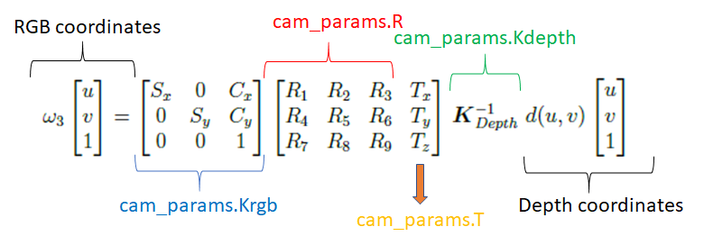
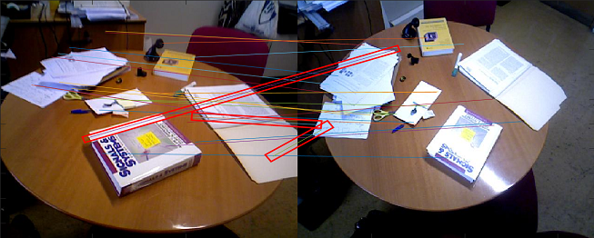
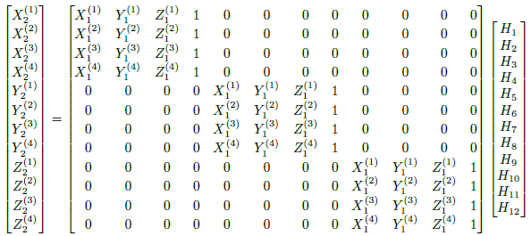

# 3DReconstruction

This project was developed for the Computer Vision course. The objective is to create a 3D reconstruction of a scene from a sequence of RGB and depth images (with guaranteed overlap between consecutive images) in Matlab. For example, from the following sequence of overlapping RGB images:


and depth images:


we obtain the following 3D point cloud:


## Approach

This project was divided into three scripts:

**rigid_body3D.m**: function that returns the 3D Rigid Body transformation between each image and the reference image (i.e., first image)

**plot3D.m**: function that returns the 3D Point Cloud based on sequence of depth and RGB images and the corresponding Rigid Body transformations

**run.m**: main script that calls the two previous scripts to obtain the 3D reconstruction of the chosen dataset.

## rigid_body3D.m

To obtain the 3D Rigid Body transformations, this script performs the following steps:

**Feature matching:** First, the SURF features of each consecutive pair of RGB images (by using native Matlab methods) are matched by means of the Nearest Neighbour method. These matches represent keypoints that are common to the pair of RGB images and are going to be used to obtain the transformation between them.

**Project depth image in RGB image plane:** After obtaining the RGB keypoints, we must find the correspondent xyz points (i.e., 3D points) based on the depth information. For that, the Camera Model is applied:



The RGB camera intrinsic parameter (Krgb), the RGB camera extrinsic parameter (R and T) and the Depth camera intrinsic parameter (Kdepth) can be found in the file **cam_params.m**

**Outlier rejection:** Usually, some matches are wrong (known as outliers) as one can see in the next image which contains 3 outliers highlighted with a red rectangle:



To remove the outliers, a method called RANSAC is performed. This method has the following steps:
```
1) Choose transformation model
2) Randomly select the minimum number of matches (pair of points) needed for the transformation
3) Estimate the parameters of the model based on those matches
4) Using the remaining matches and the model obtained in step 2, determine the transformation for each match point and calculate the error
5) Count the number of matches whose error is inferior to a given threshold (these points are known as inliers)
6) Repeat steps 2-5 for a given number of iterations and choose the matches that correspond to the highest number of inliers
```

The RANSAC was applied for the 3D coordinates (x,y,z) instead of the 2D coordinates (u,v). The model chosen was the affine model which can be represented as:


This model has 12 degrees of freedom (i.e., 12 parameters from H1 to H12). As each point gives 3 coordinates (x, y, z), the minimum number of points (step 2 from RANSAC) is 12/3 = 4. To estimate the parameters for step 3, the Direct Linear Transformation (DLT) can be applied:



After applying RANSAC, the 3 ouliers are removed:


**Obtain Rigid Body transformations:** After finding the 3D matches that are inliers, we can finally get the Rigid Body transformations. This corresponds to solve an optimization problem:


Due to the constraints of the orthogonal matrix (R), it cannot be solved by applying Least Squares. The translation component (T) can be easily obtained from the average points:


Obtaining R is equivalent to solving the Procrustes Orthogonal Problem that consists of finding the orthogonal matrix that best fits to the normalized points. It can be proved that solving that problems corresponds to solving:


where U and V are obtained by applying the Single Value Decomposition (SVD) to the normalized points.

Hence, after finding R and T, the Rigid Body transformation is:


**Iterative Closest Point (ICP):**


 